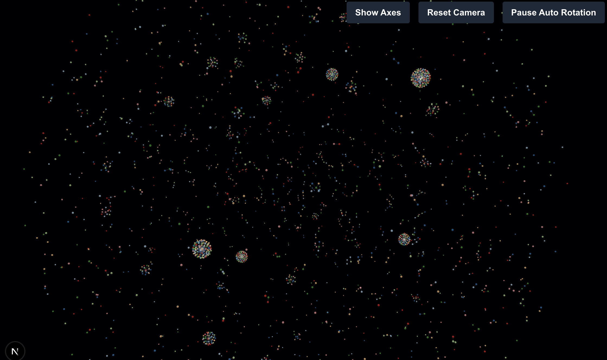

# Knowledge Graph Visualization

This project provides an interactive web page for visualizing knowledge graphs using [Next.js](https://nextjs.org) and [react-force-graph-3d](https://github.com/vasturiano/react-force-graph). It helps users explore and analyze graph data with features like auto-rotation, camera controls, and axis toggling.

## Showcase

Below is an example of the visualization in action:



## Features

- 3D interactive visualization of knowledge graphs
- Auto-rotating camera for better graph exploration
- Toggle axes and reset camera view
- Drag and focus nodes
- Responsive UI with [Geist](https://vercel.com/font) font

## Getting Started

To run the development server:

```bash
npm run dev
# or
yarn dev
# or
pnpm dev
# or
bun dev
```

Open [http://localhost:3000](http://localhost:3000) in your browser to view the visualization.

You can customize the graph data in [`app/data/data.ts`](app/data/data.ts) and the visualization logic in [`app/components/FocusGraph.tsx`](app/components/FocusGraph.tsx).

## Technologies Used

- [Next.js](https://nextjs.org)
- [React](https://react.dev)
- [react-force-graph-3d](https://github.com/vasturiano/react-force-graph)
- [Three.js](https://threejs.org)
- [Geist Font](https://vercel.com/font)
- [Tailwind CSS](https://tailwindcss.com)

## Deployment

Deploy easily on [Vercel](https://vercel.com/new?utm_medium=default-template&filter=next.js&utm_source=create-next-app&utm_campaign=create-next-app-readme).

See the [Next.js deployment documentation](https://nextjs.org/docs/app/building-your-application/deploying) for more details.
